# 🍎 EatWise: Advanced Nutrition & Safety Intelligence

> **"Know what you Eat, before you Eat."**

## 📖 Project Overview
**EatWise** is a next-generation food intelligence system designed to solve the problem of **"Blind Consumption"**.

While standard apps only count calories, **EatWise** uses AI to analyze the *quality* and *safety* of food. It scans barcodes, ingredients, and hidden additives to protect users from allergens, harmful chemicals, and lifestyle conflicts (e.g., Diabetes, Hypertension).

It functions as a powerful standalone tool but unlocks **Medical-Grade Safety** when paired with [MedWise](https://github.com/Ashita-no-Kaushar/MedWise).

---

## 🧠 The Intelligence Engine (Architecture)

This system uses a **Multi-Stage Filtering Process** to analyze food in real-time.

```mermaid
graph TD
    %% --- COLORS (Matching MedWise Theme) ---
    classDef input fill:#e2e3e5,stroke:#383d41,stroke-width:2px,color:#383d41
    classDef success fill:#d4edda,stroke:#28a745,stroke-width:2px,color:#155724
    classDef danger fill:#f8d7da,stroke:#dc3545,stroke-width:2px,color:#721c24
    classDef warning fill:#fff3cd,stroke:#ffc107,stroke-width:2px,color:#856404
    classDef logic fill:#cce5ff,stroke:#004085,stroke-width:2px,color:#004085

    %% --- INPUT LAYER ---
    subgraph Input_Layer [👁️ Input Phase]
        Scan[User Scan: Product]:::input -->|Barcode| DB[Fetch Product Data]:::input
        Scan -->|Live OCR| Text[Read Ingredients]:::input
    end

    %% Merging Inputs
    DB & Text --> Analysis{Analysis Core}:::logic

    %% --- LOGIC LAYER (Removed the Gray Box to fix Arrows) ---
    
    %% Split to Parallel Checks
    Analysis -->|Check Additives| Chem[🧪 Chemical Safety Filter]:::input
    Analysis -->|Check Profile| Profile[👤 User Health Constraints]:::input

    %% --- OUTPUTS ---
    %% Connecting Logic to Alerts (Straight Lines)
    
    Profile -- Allergy Match --> Alert[🔴 DANGER: Allergen Detected]:::danger
    Profile -- Lifestyle Clash --> Warn[🟡 WARNING: High Sugar/Salt]:::warning
    Profile -- All Safe --> Clean[🟢 SAFE: Good to Consume]:::success
    
    %% (Optional) Connecting Chemical Filter to Danger too, for completeness
    Chem -.->|Harmful Additive| Alert
```

---

## 🚀 Core Modules

### 1. 👁️ Intelligent Scanning (Multi-Modal)

* **Hybrid Recognition:** Simultaneously reads Barcodes (GS1), QR Codes, and *Raw Text* (for loose items or unbranded packaging).
* **Transliteration Engine:** Can read ingredient labels in local languages (e.g., Hindi, Gujarati) and analyze them in English.

### 2. 🧪 Hidden Chemical Detector

* **E-Number Decoder:** Automatically flags dangerous additives (e.g., E171, HFCS, Palm Oil) that are often hidden in fine print.
* **Regional Safety Check:** Flags ingredients banned in strict regions (like EU/USA) but allowed in local markets.

### 3. 👤 Bio-Individual Profiling

* **"Your Danger List":** Dynamic filtering based on specific medical conditions.
* *Example:* If User has **Hypertension**, the app flags "Sodium Benzoate" as high risk.

* **Nutrient Gap Analysis:** Tracks micronutrients (Iron, B12, Zinc) to prevent silent deficiencies.

---

## 🔗 The Ecosystem: EatWise + MedWise

**EatWise** is Part 1 of the **Wise Health Ecosystem**.
When connected with **MedWise**, it prevents dangerous **Drug-Food Interactions**.

| Feature | EatWise Standalone | With MedWise Integration |
| --- | --- | --- |
| **Sugar Tracking** | Tracks daily sugar intake | **Alerts:** "Stop! Insulin is active." |
| **Dairy Tracking** | Tracks Calcium intake | **Alerts:** "Wait 2 hrs (Antibiotic Active)." |
| **Grapefruit/Citrus** | General Vitamin C data | **Warning:** "Toxic Interaction with Statins." |

> *To see the Pharmaceutical Architecture, visit the [MedWise Repository](https://github.com/Ashita-no-Kaushar/MedWise).*

---

## 🛠️ Tech Stack Strategy

* **Mobile Frontend:** Flutter (iOS/Android)
* **AI & Vision:** * **Google ML Kit:** On-device Text Recognition (OCR).
* **TensorFlow Lite:** Custom model for packaging recognition.

* **Data Sources:** OpenFoodFacts API + Proprietary Local Ingredient Database.
* **Backend:** Python (FastAPI) for high-speed analysis.

---

## ⚠️ Intellectual Property & Legal Notice

**© 2026 Kaushar Halani. All Rights Reserved.**

This repository serves as the **Timestamped Proof of Concept (PoC) and Architectural Blueprint** for EatWise.

* **Proprietary Rights:** The specific logic for **"Hidden Chemical Detection"** and the **"Bio-Individual Filtering Algorithm"** is the intellectual property of the author.
* **No License:** This work is **NOT Open Source**. Unauthorized copying, reproduction, reverse engineering, or commercial use of this roadmap/concept is strictly prohibited.
* **Commercial Inquiry:** Investors or HealthTech partners interested in this IP may contact the author below.

---

## 🤝 Contact

* **Author:** Kaushar Halani
* **Role:** Product Architect & Developer
* **LinkedIn:** [Kaushar Halani](https://www.linkedin.com/in/kaushar-halani)

---

*Blueprint Locked: Jan 2026*

